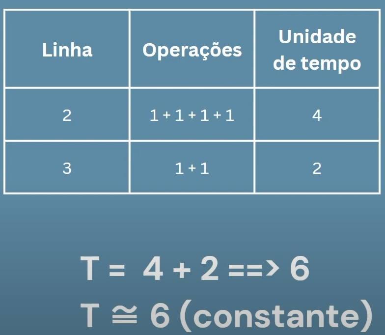

## Algoritmos Constantes

Calculando complexidade de tempo de um algortimo constante (Big O) 

```Go
func calculate(x, y int) int {
	result := x + y
	return result
}
```

<div align="center"></div>

```Go
func getValueByKey(array []int, k int) int {
	return array[k]
}
```