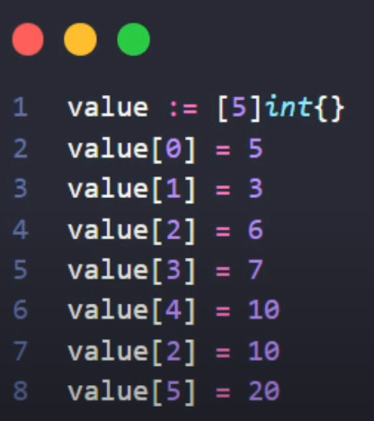

## Array vs Slice

Para termos um array, conseguimos definir pelo valor := []int {}

Assim sendo a finalização desse modo:

## Slice

Diferentemente do array, definimos o slice sem tamanho. Criando uma lista literalmente vazia. Assim sendo mais versátil pois permite colocar 1 milhão de itens permanentes, mas devemos ter cuidado para não dar index *index out of bounds* (índice que está fora do limite) fazendo quebrar a aplicação.

- Para adicionar itens no slice, devemos usar **append**.

