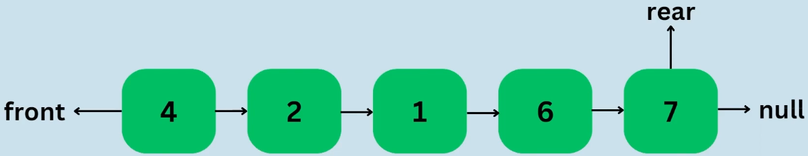
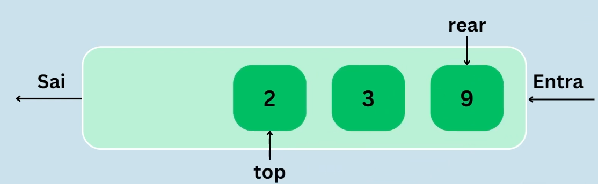
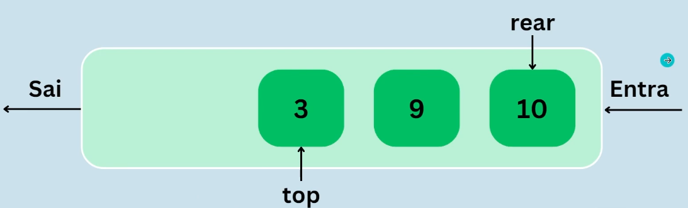

## Fila / Queue

Maneira de organizar os dados linearmente, a organização é bem simples e é utilizado em sistemas conhecidos como AWS SQS. Os dados inseridos primeiro, serão também os primerios a sairem da lista, o que chamamos de **Frist In, First Out (FIFO)**.

## Exemplo

Imagine uma fila de pessoas, quando uma pessoa chega, ela é a última da fila e assim é com o código.

## Dequeue

Basicamente remover o primeiro que entrou na fila.

- Neste caso, o número dois era o primeiro da lista, ao fazer o dequeue, ele é o primeiro a sair, após isso, sairá o 3, 9 e assim por diante.
