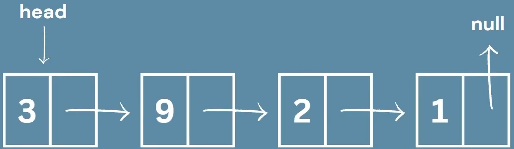

## Lista ligada (Singly Linked Lists)

Uma lista ligada é uma estrutura que guarda nós ligados, que seguem as seguintes propriedades:

- Contém uma sequência de nós
- Um nó tem uma informação, valor e guarda o endereço do próximo do nó
- O primeiro nó é o "head"
- O último aponta para o nulo

<div align="center"></div>

```Go
type Node struct {
    Data string // Pode ser qualquer tipo
    Next *Node //Aponta como próximo infinitamente
}
```