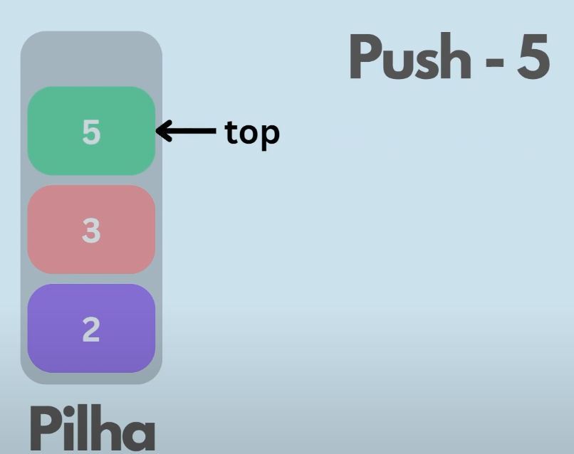
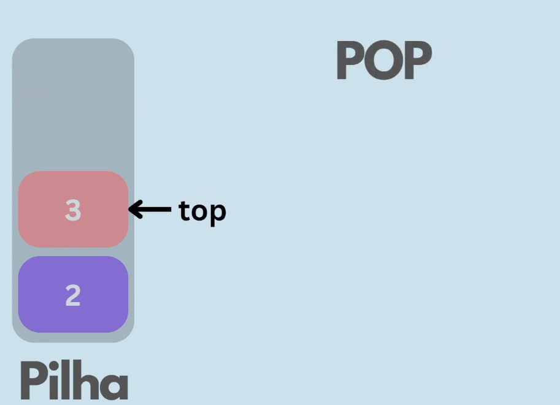

## Pilha / Stack

Resumidamente uma estrutura de dados linear utilizada para armazenar dados, os dados sempre são adicionados ou excluídos do fim da pilha, chamada top. O último item inserido na lista, será o primerio á ser excluido, chamado **LIFO**(Last In First Out)

## Exemplo real

Imagine que você está lavando uma louça, sempre você irá pegar o último prato empilhado para enxugar, e assim é com o código.
 

- O *TOP* sempre irá apontar para o último inserido.
- O *POP* sempre irá remover o újltimo que foi inserido.

