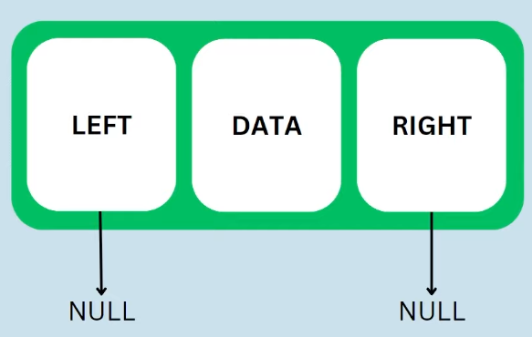

## Árvore 

Estrutura de dados não linear utilizada para guardar dados, é feito a partir de nodes nos quais não podem estar em loop, cada nó da árvore pode apontar para N números de nodes na árvore, uma forma de representar uam estrutura hierárquica com um node root e vários níveis abaixo.

Utiliza-se o mesmo conceito da lista ligada mas de forma mais complexa.

- Basicamente um nó (objeto, struct) que dentro dele vai ter um objeto do mesmo tipo (ponteiro), que aponta para esquerda, para direita e um valor que aponta para o próprio nó.

```Go
type treeNode struct {
    data int
    left *TreeNode // Ponteiro do treeNode
    right *TreeNode // Ponteiro do treeNode
}
```
Ao inicializar uma árvore esses são os dados:
<div align="center"></div>
- Utilizamos ponteiro para apontar os dados para o objeto, caso não, o objeto será sempre vazio, e não saberemos se o objeto é vazio ou se está com algum problema.